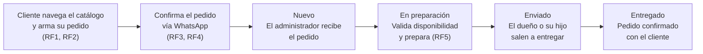

# 🔥 Leños Rellenos - WebApp

Aplicación web para la digitalización del proceso de venta del negocio familiar **Leños Rellenos**, desarrollada como parte del curso de *Desarrollo Web Integral* — Instrumento de Recuperación 2, **Caso 1**.

El objetivo es permitir al negocio mostrar su catálogo de producto, recibir pedidos mediante un carrito de compras, canalizar la confirmación de compra por WhatsApp, y dar al dueño del negocio un panel de control simple para gestionar productos, stock y pedidos — sin complicar su forma actual de trabajar.

---

## 📌 Control de Versiones

### ¿Por qué es indispensable el versionamiento en este proyecto?

El desarrollo de esta aplicación involucra cambios simultáneos en múltiples frentes: el catálogo visual de productos, la lógica del carrito de compras, la integración con WhatsApp, y el panel de administración — el cual maneja datos sensibles de clientes y pedidos (nombres, direcciones de entrega, historial de compra). Sin un sistema de control de versiones, sería imposible rastrear qué cambio afectó qué módulo, revertir errores en producción sin perder trabajo válido, o permitir que distintas partes del sistema evolucionen en paralelo sin sobrescribirse entre sí. El versionamiento no es opcional aquí: es lo que permite que el módulo de pedidos (crítico, con datos de clientes) se trate con más cuidado que, por ejemplo, un ajuste visual en el catálogo.

### Git vs. SVN

Se eligió **Git** sobre SVN por tres razones directamente ligadas a este proyecto:

1. **Trabajo distribuido y sin dependencia de un servidor central**: al ser un proyecto pequeño con posibilidad de trabajarse en distintos horarios (negocio familiar, disponibilidad limitada), Git permite hacer commits localmente sin necesidad de conexión constante a un repositorio central, algo que SVN no ofrece.
2. **Ramas ligeras**: el ritmo de entregas de este proyecto es incremental (catálogo → carrito → WhatsApp → panel admin), lo cual encaja naturalmente con la creación y descarte rápido de ramas de Git. En SVN, las ramas son costosas de crear y fusionar.
3. **Ecosistema y curva de adopción**: dado que este es un negocio familiar con recursos limitados, Git tiene una comunidad, documentación y herramientas gratuitas (como GitHub) muchísimo más accesibles que las alternativas de SVN.

### Selección de plataforma: GitHub

Se seleccionó **GitHub** como plataforma de alojamiento del repositorio, considerando al menos los siguientes criterios del caso:

- **Negocio familiar con recursos limitados** → GitHub ofrece repositorios públicos y privados ilimitados de forma gratuita, sin costo de licenciamiento, lo cual es indispensable para un proyecto sin presupuesto de infraestructura.
- **Simplicidad y facilidad de uso** → GitHub tiene la curva de aprendizaje más baja del mercado (comparado con GitLab o Bitbucket) para un desarrollador que gestiona el proyecto de forma prácticamente individual, además de integrar en un mismo lugar Issues, Projects (tableros Kanban) y Pull Requests sin necesidad de configuración adicional.

### Configuración de seguridad y control de acceso

| Parámetro | Configuración | Justificación |
|---|---|---|
| **Autenticación** | SSH (llave `ed25519`) | Se usa SSH en lugar de HTTPS porque el proyecto eventualmente manejará datos sensibles de clientes (nombres, direcciones, pedidos) a través del backend conectado a MongoDB Atlas; SSH evita introducir credenciales en cada operación de red y reduce el riesgo de exposición de contraseñas. |
| **Rotación de llaves** | Cada 90 días, o inmediatamente si se sospecha compromiso | Al ser datos de clientes los que están en juego, se sigue una política de rotación periódica de llaves SSH como buena práctica de seguridad, minimizando la ventana de exposición si una llave llegara a filtrarse. |
| **Protección de `main`** | Pull Request obligatorio + al menos 1 aprobación + status checks antes de mergear | La rama `main` representa el código en producción; forzar revisión por PR evita que un cambio no probado (por ejemplo, en el módulo de pedidos) llegue directo a producción. |
| **CODEOWNERS** | Ver archivo [`CODEOWNERS`](./CODEOWNERS) | Define quién debe revisar y aprobar cambios según el módulo afectado (Frontend, Backend, Panel de Administración), evitando que se aprueben cambios críticos sin la revisión adecuada. |

---

## 🔀 Flujo de Trabajo del Control de Versiones

### Flujo del negocio (proceso operativo del pedido)

Antes de justificar el flujo de ramas, es importante mostrar el proceso
**real** por el que pasa un pedido en Leños Rellenos — el mismo proceso
que representa el tablero Kanban del proyecto (columnas Nuevo → En
preparación → Enviado → Entregado):



Este flujo justifica por qué el tablero del proyecto usa estas 4
columnas en lugar de un Kanban genérico (To Do / In Progress / Done):
cada columna representa una etapa real de la logística descrita en el
caso de estudio — validación manual del administrador, y entrega a
cargo del dueño y su hijo, sin depender de servicios externos de
delivery por tratarse de un negocio familiar con recursos limitados.

### Ritmo de entregas: MVP incremental

El desarrollo sigue un ritmo de **entregas incrementales tipo MVP**, alineado a las fases naturales del negocio identificadas en el caso: **Catálogo → Carrito → Integración WhatsApp → Panel de Administración**. Cada fase es funcional por sí sola y se integra sobre la anterior, permitiendo validar con el dueño del negocio (el "cliente" real de este proyecto) que cada bloque resuelve su necesidad antes de avanzar al siguiente, en lugar de entregar todo el sistema de golpe al final.

### Comparación de flujos de trabajo

La comparación se evalúa contra el escenario específico del negocio: un
flujo de pedido con 4 etapas reales (Nuevo → En preparación → Enviado →
Entregado) donde cada etapa la ejecuta una sola persona (el
administrador/desarrollador), sin equipo de soporte, y donde una falla
en producción afecta directamente pedidos y datos de clientes reales.

| Flujo | Características | ¿Cómo soporta el ciclo del pedido (Nuevo → Preparación → Enviado → Entregado)? |
|---|---|---|
| **Git Flow** | Ramas `main`, `develop` y `feature/*` por funcionalidad; `main` solo recibe código ya probado en `develop`. Da control fino sobre qué se libera y cuándo. | ✅ **Elegido.** `develop` actúa como zona de pruebas antes de tocar `main` (producción real, donde vive el panel que gestiona el ciclo del pedido) — evita que un cambio a medio probar rompa la gestión de pedidos en curso. |
| **GitHub Flow** | Solo `main` + ramas `feature/*` que se mergean directo a `main` vía PR. Pensado para despliegue continuo. | ❌ Descartado. Sin una rama de integración intermedia, un error en el módulo de "Preparación" o "Enviado" impactaría `main` de inmediato — riesgoso al manejar datos de pedidos y clientes en tiempo real. |
| **Trunk-Based Development** | Todos commitean directo (o casi) sobre una única rama principal, con feature flags para ocultar trabajo incompleto. | ❌ Descartado. Exigiría feature flags y CI robusto para ocultar cambios a medias del ciclo de pedido (ej. un cambio incompleto al pasar de "Nuevo" a "En preparación"), algo que no se justifica para un proyecto de un solo desarrollador con recursos limitados. |


### Estrategia de ramas y protección diferenciada

```
main        → producción. Protegida: PR + aprobación + status checks + CODEOWNERS.
  └─ develop  → integración de las fases del MVP. Protegida: PR requerido (sin aprobación obligatoria de un tercero, dado que el equipo es de un solo desarrollador).
       ├─ feature/catalogo       (RF1, RF5, RF6, RF7)
       ├─ feature/carrito        (RF2, RNF4)
       ├─ feature/whatsapp       (RF3, RF4)
       └─ feature/panel-admin    (gestión de productos y pedidos — datos sensibles)
```

La protección es **diferenciada según criticidad del módulo**: `feature/panel-admin` requiere que su PR hacia `develop` se revise con más detalle porque expone datos de pedidos y clientes, mientras que `feature/catalogo` (puramente visual) tiene un flujo de revisión más ligero.

---

## 🏗️ Arquitectura del Proyecto

El repositorio sigue una **arquitectura de 3 capas**, tal como lo define el caso de estudio:

```
Lenos-Rellenos-WebApp/
├── frontend/               # HTML5 / CSS3 / JavaScript responsivo
│   ├── index.html          # Catálogo visual con carrusel (RF1, RF7)
│   ├── css/                # Estilos (paleta café/naranja del negocio)
│   ├── js/
│   │   ├── carrito.js      # Carrito de compras (RF2, RNF4)
│   │   ├── whatsapp.js     # Botón de compra → WhatsApp (RF3, RF4)
│   │   └── disponibilidad.js  # Stock y horario del negocio (RF5, RF6)
│   └── pages/
│       └── admin.html      # Panel de administración
│
├── backend/                # Node.js + Express (API REST)
│   └── src/
│       ├── config/         # Conexión a MongoDB Atlas
│       ├── models/         # Producto, Pedido, Cliente
│       ├── controllers/    # Lógica de negocio
│       └── routes/         # Endpoints REST
│
└── CODEOWNERS               # Gobierno de revisión por módulo
```

- **Frontend**: HTML5, CSS3 y JavaScript puro, responsivo (RNF1), enfocado en una interfaz simple e intuitiva (RF7, RNF3).
- **Backend**: Node.js con Express, exponiendo una API REST para productos y pedidos.
- **Base de datos**: MongoDB Atlas (servicio administrado en la nube, sin necesidad de mantener infraestructura propia — coherente con los recursos limitados del negocio).

---

## 🗄️ Modelo de Datos

El modelo de datos refleja las entidades identificadas en el caso de estudio:

- **Cliente**: datos básicos de contacto del comprador (nombre, teléfono/WhatsApp, dirección de entrega).
- **Producto**: cada variante de leño relleno (nombre, sabor, precio, foto, disponibilidad/stock).
- **Categoría**: agrupación de productos (ej. tipos de sabor).
- **Pedido**: registro de una compra realizada por un cliente (estado: nuevo, en preparación, enviado, entregado).
- **DetallePedido**: relación entre un pedido y los productos/cantidades que lo componen.

---

## 📋 Requerimientos Funcionales (MVP)

| ID | Requerimiento |
|---|---|
| RF1 | Visualización del menú completo de productos |
| RF2 | Carrito de compras |
| RF3 | Botón de compra directa que redirige a WhatsApp |
| RF4 | Generación automática del mensaje de pedido |
| RF5 | Visualización de disponibilidad (stock) |
| RF6 | Indicador de horario del negocio (abierto/cerrado) |
| RF7 | Interfaz sencilla, rápida y fácil de usar |

**Requerimientos no funcionales**: interfaz responsiva (RNF1), carga del menú en menos de 3 segundos (RNF2), interfaz intuitiva (RNF3), persistencia del carrito al recargar (RNF4), y coherencia visual con la identidad del negocio (RNF5).

---

## 🚀 Tecnologías

- **Frontend**: HTML5, CSS3, JavaScript
- **Backend**: Node.js, Express
- **Base de datos**: MongoDB Atlas
- **Control de versiones**: Git + GitHub
- **Calidad de código**: ESLint, Husky, lint-staged, Commitlint (Conventional Commits)

---

## 📄 Licencia

Este proyecto está bajo la licencia MIT — ver el archivo [`LICENSE`](./LICENSE).
